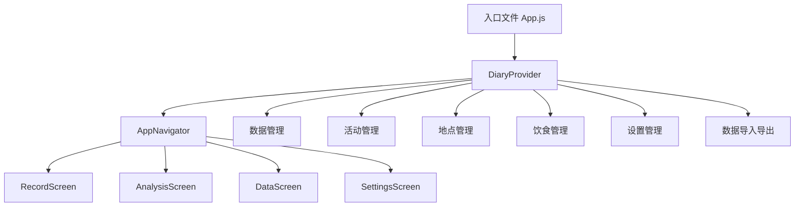
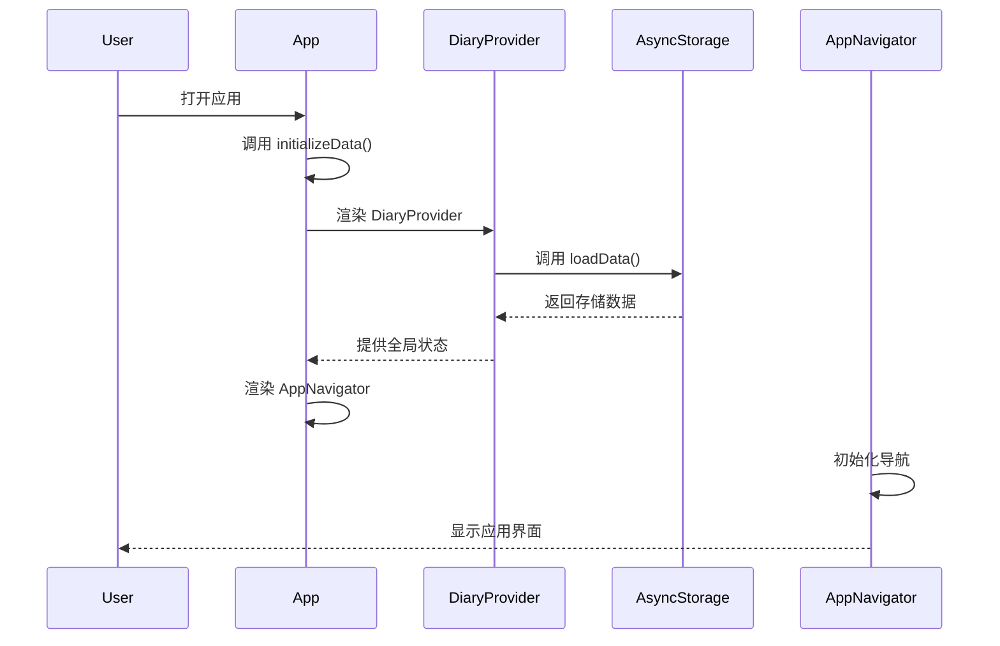
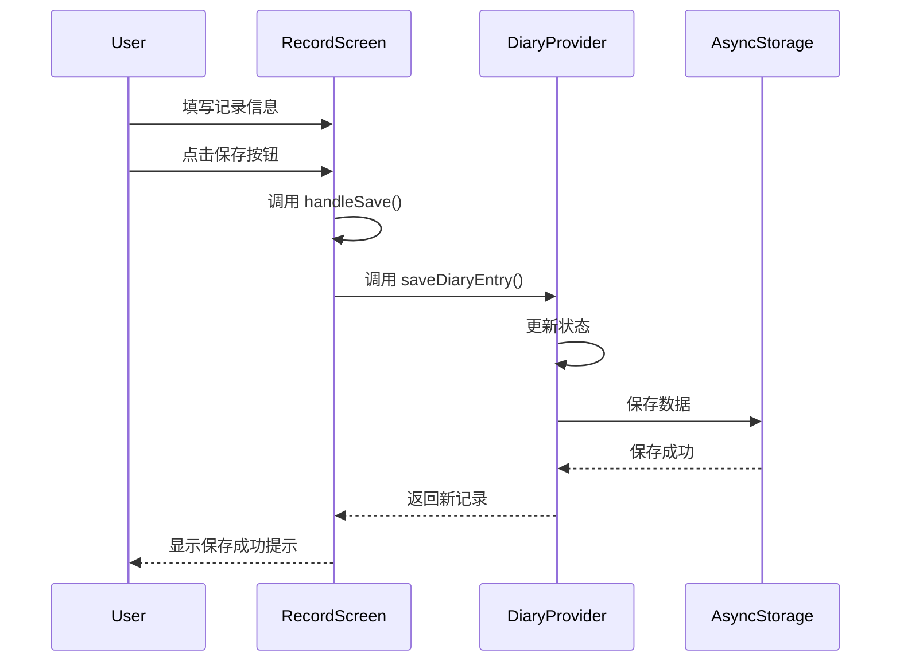
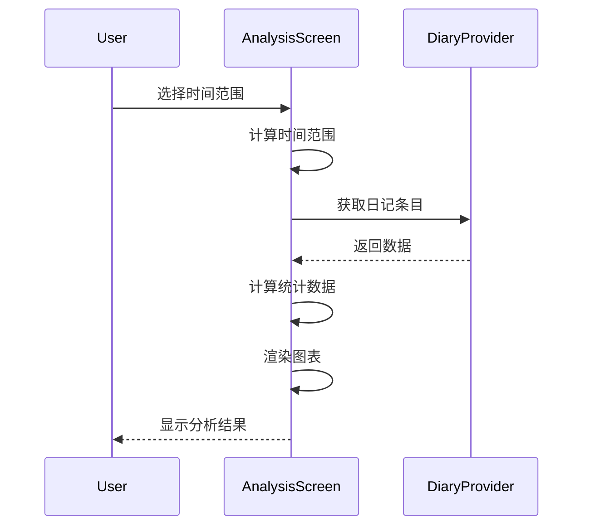
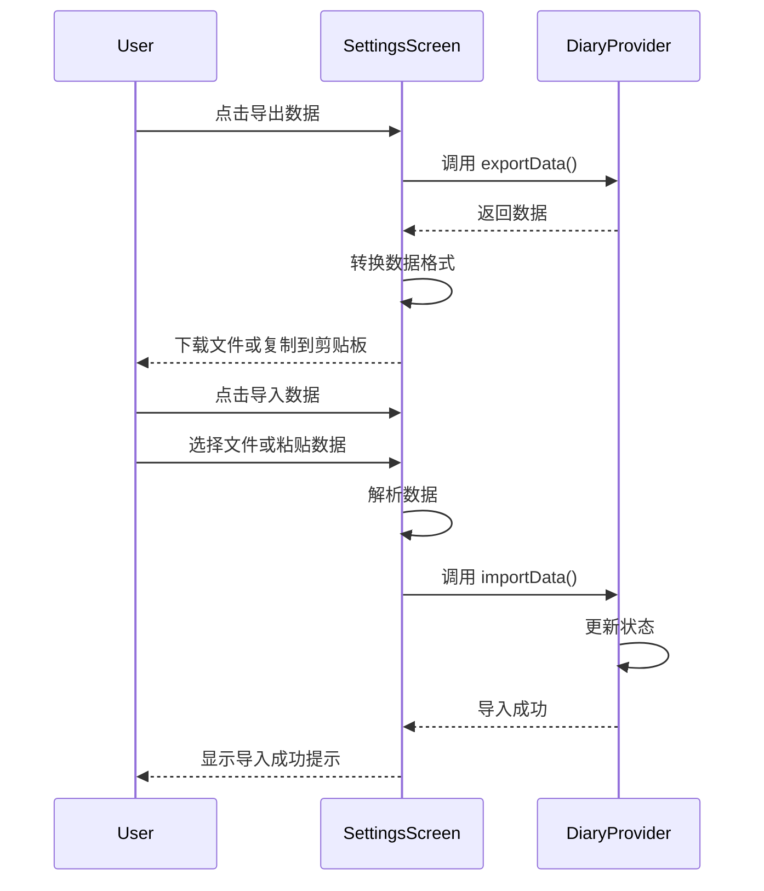

# 口己1 项目架构分析

## 1. 项目概述

口己1 是一款用于记录和分析个人日常活动的应用，支持 Web 和移动平台。项目采用 React Native 开发，使用 Expo 框架，数据存储在本地 AsyncStorage 中。

## 2. 架构设计

### 2.1 整体架构



### 2.2 模块划分

| 模块 | 主要职责 | 文件位置 | 核心函数 |
|------|---------|---------|----------|
| 应用入口 | 应用初始化、导航配置 | App.js | initializeData, AppNavigator |
| 全局状态管理 | 数据存储、状态管理 | src/contexts/DiaryContext.js | DiaryProvider, loadData, saveDiaryEntry |
| 记录模块 | 记录日常活动 | src/screens/RecordScreen.js | handleSave, toggleActivity, toggleFoodCategory |
| 分析模块 | 数据分析、图表展示 | src/screens/AnalysisScreen.js | moodData, tagStats, locationStats, foodStats |
| 数据模块 | 历史记录管理 | src/screens/DataScreen.js | handleDayPress, handleDeleteEntry, handleEditEntry |
| 设置模块 | 应用设置、数据管理 | src/screens/SettingsScreen.js | handleLanguageChange, handleThemeChange, handleExportData, handleImportData |

## 3. 核心方法函数

### 3.1 应用入口相关

| 函数名 | 功能描述 | 参数 | 返回值 | 调用关系 |
|--------|---------|------|--------|----------|
| `initializeData()` | 初始化应用数据 | 无 | 无 | 应用启动时调用 |
| `AppNavigator()` | 导航组件 | 无 | React 组件 | 被 App 组件调用 |

### 3.2 全局状态管理相关

| 函数名 | 功能描述 | 参数 | 返回值 | 调用关系 |
|--------|---------|------|--------|----------|
| `loadData()` | 加载应用数据 | 无 | 无 | 组件挂载时调用 |
| `saveDiaryEntry(entry)` | 保存日记条目 | entry: object | newEntry: object | 记录页面调用 |
| `updateDiaryEntry(id, updates)` | 更新日记条目 | id: number, updates: object | 无 | 数据页面调用 |
| `deleteDiaryEntry(id)` | 删除日记条目 | id: number | 无 | 数据页面调用 |
| `addActivity(activity)` | 添加活动 | activity: object | newActivity: object | 设置页面调用 |
| `updateActivity(id, updates)` | 更新活动 | id: number, updates: object | 无 | 设置页面调用 |
| `deleteActivity(id)` | 删除活动 | id: number | 无 | 设置页面调用 |
| `addLocation(location)` | 添加地点 | location: object | newLocation: object | 设置页面调用 |
| `updateLocation(id, updates)` | 更新地点 | id: number, updates: object | 无 | 设置页面调用 |
| `deleteLocation(id)` | 删除地点 | id: number | 无 | 设置页面调用 |
| `addFoodCategory(category)` | 添加饮食分类 | category: object | newCategory: object | 设置页面调用 |
| `updateFoodCategory(id, updates)` | 更新饮食分类 | id: number, updates: object | 无 | 设置页面调用 |
| `deleteFoodCategory(id)` | 删除饮食分类 | id: number | 无 | 设置页面调用 |
| `addFoodItem(item)` | 添加食物 | item: object | newItem: object | 记录页面和设置页面调用 |
| `updateFoodItem(id, updates)` | 更新食物 | id: number, updates: object | 无 | 设置页面调用 |
| `deleteFoodItem(id)` | 删除食物 | id: number | 无 | 设置页面调用 |
| `updateSettings(newSettings)` | 更新设置 | newSettings: object | 无 | 设置页面调用 |
| `exportData()` | 导出数据 | 无 | data: string | 设置页面调用 |
| `importData(jsonData)` | 导入数据 | jsonData: string | 无 | 设置页面调用 |

### 3.3 记录模块相关

| 函数名 | 功能描述 | 参数 | 返回值 | 调用关系 |
|--------|---------|------|--------|----------|
| `handleSave()` | 保存记录 | 无 | 无 | 点击保存按钮时调用 |
| `toggleActivity(activityId)` | 切换活动选择状态 | activityId: string/number | 无 | 点击活动标签时调用 |
| `toggleFoodCategory(categoryId)` | 切换饮食分类选择状态 | categoryId: string/number | 无 | 点击饮食分类标签时调用 |
| `handleSaveFood()` | 保存食物 | 无 | 无 | 点击添加食物按钮时调用 |
| `handleSelectExistingFood(foodName)` | 选择已存在的食物 | foodName: string | 无 | 点击已存在的食物时调用 |
| `handleRandomFood()` | 随机选择食物 | 无 | 无 | 点击随机食物按钮时调用 |
| `handleConfirmFoodSelection()` | 确认食物选择 | 无 | 无 | 点击确认按钮时调用 |

### 3.4 分析模块相关

| 函数名 | 功能描述 | 参数 | 返回值 | 调用关系 |
|--------|---------|------|--------|----------|
| `getDateRange()` | 获取时间范围 | 无 | { startDate, endDate } | 计算统计数据时调用 |
| `isDateInRange(date)` | 检查日期是否在范围内 | date: string | boolean | 过滤数据时调用 |
| `moodData` | 计算心情数据 | 无 | { labels, datasets } | 渲染心情图表时调用 |
| `tagStats` | 计算活动统计 | 无 | array | 渲染活动饼图时调用 |
| `locationStats` | 计算地点统计 | 无 | array | 渲染地点饼图时调用 |
| `foodStats` | 计算食物统计 | 无 | array | 渲染食物饼图时调用 |
| `mostFrequentMood` | 计算最常出现的心情 | 无 | object | 显示统计信息时调用 |
| `lastHappyDate` | 计算上一次开心的日期 | 无 | string | 显示统计信息时调用 |
| `handleTimeRangeChange(range)` | 处理时间范围变化 | range: string | 无 | 选择时间范围时调用 |
| `handleCustomRangeConfirm()` | 确认自定义时间范围 | 无 | 无 | 点击确认按钮时调用 |

### 3.5 数据模块相关

| 函数名 | 功能描述 | 参数 | 返回值 | 调用关系 |
|--------|---------|------|--------|----------|
| `markedDates` | 计算日历标记 | 无 | object | 渲染日历时调用 |
| `selectedDateEntries` | 获取选中日期的记录 | 无 | array | 显示选中日期记录时调用 |
| `allEntries` | 获取所有记录 | 无 | array | 显示历史记录时调用 |
| `handleDayPress(day)` | 处理日期点击 | day: object | 无 | 点击日历时调用 |
| `handleDeleteEntry(entry)` | 处理删除记录 | entry: object | 无 | 点击删除按钮时调用 |
| `handleEditEntry(entry)` | 处理编辑记录 | entry: object | 无 | 点击编辑按钮时调用 |
| `handleSaveEdit()` | 保存编辑 | 无 | 无 | 点击保存按钮时调用 |
| `toggleTag(tagId)` | 切换标签选择状态 | tagId: string/number | 无 | 编辑记录时调用 |

### 3.6 设置模块相关

| 函数名 | 功能描述 | 参数 | 返回值 | 调用关系 |
|--------|---------|------|--------|----------|
| `handleLanguageChange(language)` | 处理语言变化 | language: string | 无 | 选择语言时调用 |
| `handleThemeChange(theme)` | 处理主题变化 | theme: string | 无 | 选择主题时调用 |
| `handleAddActivity()` | 处理添加活动 | 无 | 无 | 点击添加活动按钮时调用 |
| `handleEditActivity(activity)` | 处理编辑活动 | activity: object | 无 | 点击编辑活动按钮时调用 |
| `handleSaveActivity()` | 保存活动 | 无 | 无 | 点击保存活动按钮时调用 |
| `handleDeleteActivity(activity)` | 处理删除活动 | activity: object | 无 | 点击删除活动按钮时调用 |
| `handleAddLocation()` | 处理添加地点 | 无 | 无 | 点击添加地点按钮时调用 |
| `handleEditLocation(location)` | 处理编辑地点 | location: object | 无 | 点击编辑地点按钮时调用 |
| `handleSaveLocation()` | 保存地点 | 无 | 无 | 点击保存地点按钮时调用 |
| `handleDeleteLocation(location)` | 处理删除地点 | location: object | 无 | 点击删除地点按钮时调用 |
| `handleAddFoodCategory()` | 处理添加饮食分类 | 无 | 无 | 点击添加饮食分类按钮时调用 |
| `handleEditFoodCategory(category)` | 处理编辑饮食分类 | category: object | 无 | 点击编辑饮食分类按钮时调用 |
| `handleSaveFoodCategory()` | 保存饮食分类 | 无 | 无 | 点击保存饮食分类按钮时调用 |
| `handleDeleteFoodCategory(category)` | 处理删除饮食分类 | category: object | 无 | 点击删除饮食分类按钮时调用 |
| `handleAddFoodItem(categoryId)` | 处理添加食物 | categoryId: string/number | 无 | 点击添加食物按钮时调用 |
| `handleEditFoodItem(item)` | 处理编辑食物 | item: object | 无 | 点击编辑食物按钮时调用 |
| `handleSaveFoodItem()` | 保存食物 | 无 | 无 | 点击保存食物按钮时调用 |
| `handleDeleteFoodItem(item)` | 处理删除食物 | item: object | 无 | 点击删除食物按钮时调用 |
| `handleToggleLocationExclusion(locationId)` | 处理地点排除 | locationId: string/number | 无 | 切换地点排除状态时调用 |
| `convertDataToFormat(data, format)` | 转换数据格式 | data: string, format: string | string | 导出数据时调用 |
| `parseImportData(data)` | 解析导入数据 | data: string | string | 导入数据时调用 |
| `handleExportData()` | 处理导出数据 | 无 | 无 | 点击导出数据按钮时调用 |
| `handleImportData()` | 处理导入数据 | 无 | 无 | 点击导入数据按钮时调用 |
| `copySettingsToClipboard()` | 复制设置到剪贴板 | 无 | 无 | 点击复制设置按钮时调用 |
| `exportRecords(format)` | 导出记录 | format: string | 无 | 点击导出记录按钮时调用 |

## 4. 功能模块

### 4.1 记录功能

- **活动记录**：支持选择多个活动标签
- **地点记录**：支持选择一个地点
- **饮食记录**：支持按分类添加食物，可随机选择食物
- **心情记录**：支持 1-5 分的心情评分
- **备注记录**：支持添加文字备注
- **日期选择**：支持选择记录日期

### 4.2 数据分析功能

- **时间范围选择**：支持本周、本月、上月、自定义时间范围
- **心情趋势**：显示每天的平均心情
- **活动统计**：显示活动分布饼图
- **地点分析**：显示地点分布饼图
- **食物分析**：显示食物分布饼图
- **统计报告**：显示最常去的地点、最喜欢吃的食物、最常出现的心情、上一次感到开心的日期

### 4.3 数据管理功能

- **日历视图**：显示带有心情标记的日历
- **历史记录**：按时间顺序显示所有记录
- **记录编辑**：支持编辑现有记录
- **记录删除**：支持删除记录
- **日期筛选**：点击日历日期可筛选对应日期的记录

### 4.4 设置功能

- **语言设置**：支持中文和英文切换
- **主题设置**：支持浅色和深色主题切换
- **活动管理**：支持添加、编辑、删除活动
- **地点管理**：支持添加、编辑、删除地点
- **饮食管理**：支持添加、编辑、删除饮食分类和食物
- **数据导入导出**：支持 JSON、CSV、Excel、TXT 格式的导入导出
- **地点排除**：支持排除某些地点在分析中显示

## 5. 数据结构

### 5.1 日记条目结构

```javascript
{
  id: Date.now(), // 唯一标识符
  date: new Date().toISOString(), // 记录日期
  activities: [1, 2], // 活动 ID 数组
  location: 1, // 地点 ID
  foods: {
    '1': '米饭', // 饮食分类 ID: 食物名称
    '2': '苹果'
  },
  mood: 3, // 心情评分（1-5）
  notes: '备注信息' // 备注
}
```

### 5.2 活动结构

```javascript
{
  id: Date.now(), // 唯一标识符
  name: '工作', // 活动名称
  color: '#6366f1' // 活动颜色
}
```

### 5.3 地点结构

```javascript
{
  id: Date.now(), // 唯一标识符
  name: '家', // 地点名称
  color: '#6366f1' // 地点颜色
}
```

### 5.4 饮食分类结构

```javascript
{
  id: Date.now().toString(), // 唯一标识符
  name: '早餐', // 分类名称
  color: '#6366f1' // 分类颜色
}
```

### 5.5 食物结构

```javascript
{
  id: Date.now().toString(), // 唯一标识符
  name: '米饭', // 食物名称
  categoryId: '1' // 分类 ID
}
```

### 5.6 设置结构

```javascript
{
  language: 'zh', // 语言
  theme: 'light', // 主题
  excludedLocations: [] // 排除的地点
}
```

## 6. 调用关系

### 6.1 应用启动流程



### 6.2 记录保存流程



### 6.3 数据分析流程



### 6.4 数据导入导出流程



## 7. 技术特点

1. **跨平台支持**：使用 React Native 和 Expo 框架，支持 Web 和移动平台
2. **本地数据存储**：使用 AsyncStorage 存储数据，数据完全保存在本地
3. **响应式设计**：适配不同屏幕尺寸
4. **数据可视化**：使用 react-native-chart-kit 实现各种图表
5. **多语言支持**：内置中英文切换
6. **主题切换**：支持浅色和深色主题
7. **数据导入导出**：支持多种格式的数据备份和恢复
8. **模块化设计**：清晰的代码结构和模块划分

## 8. 代码优化建议

1. **状态管理优化**：考虑使用 Redux 或 Zustand 等状态管理库，简化复杂状态的管理
2. **性能优化**：
   - 使用 useMemo 和 useCallback 优化渲染性能
   - 优化图表渲染，避免频繁重绘
   - 分页加载历史记录，避免一次性加载大量数据
3. **错误处理**：增加更完善的错误处理机制，特别是在数据存储和导入导出时
4. **代码规范**：使用 ESLint 和 Prettier 保持代码规范
5. **单元测试**：添加单元测试，提高代码质量
6. **类型检查**：使用 TypeScript 进行类型检查，减少运行时错误
7. **文档完善**：增加更详细的代码注释和文档
8. **用户体验**：
   - 添加加载状态和过渡动画
   - 优化表单验证和错误提示
   - 增加更多的用户反馈

## 9. 总结

口己1 是一款功能丰富、设计合理的个人日常活动记录和分析应用。它采用 React Native 开发，支持 Web 和移动平台，数据存储在本地 AsyncStorage 中。

应用的架构清晰，代码组织合理，核心功能模块划分明确。通过分析其架构和方法函数，我们可以看到它是一个设计良好的前端应用，具有良好的可扩展性和可维护性。

未来可以通过状态管理优化、性能优化、错误处理完善等方式进一步提升应用的质量和用户体验。