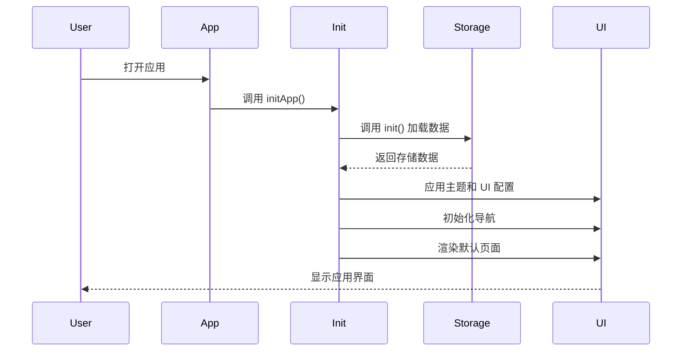
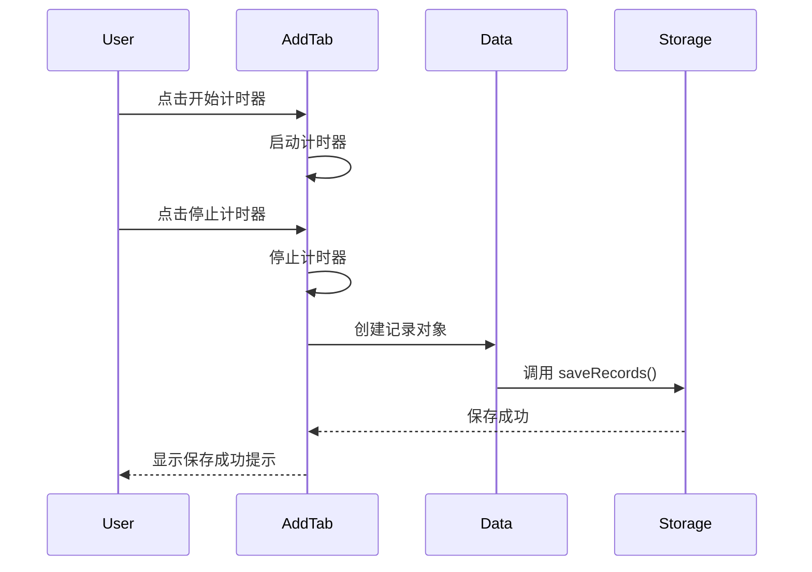
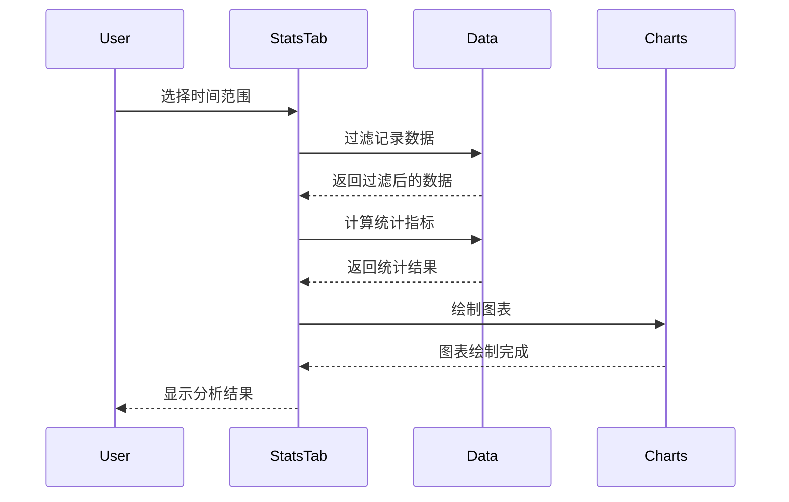

# 起飞助手架构分析

## 1. 项目概述

起飞助手是一款用于记录和分析个人行为的开源应用，支持 Web 和移动平台。项目采用纯前端实现，使用原生 JavaScript 和 HTML/CSS，数据存储在本地 localStorage 中。

## 2. 架构设计

### 2.1 整体架构

```mermaid
flowchart TD
    A[入口文件 index.html] --> B[app.js]
    B --> C[初始化模块]
    B --> D[渲染模块]
    B --> E[数据管理模块]
    B --> F[工具函数模块]
    B --> G[图表绘制模块]
    B --> H[数据导入导出模块]
    B --> I[UI 配置模块]
    
    C --> J[init 函数]
    C --> K[initApp 函数]
    
    D --> L[renderAddTab]
    D --> M[renderRecordsTab]
    D --> N[renderStatsTab]
    D --> O[renderSettingsTab]
    D --> P[渲染子页面函数]
    
    E --> Q[saveRecords]
    E --> R[saveMedia]
    E --> S[saveFetishes]
    E --> T[saveStatsConfig]
    E --> U[saveUIConfig]
    
    F --> V[formatDuration]
    F --> W[formatDate]
    F --> X[getMediumLabel]
    F --> Y[getFetishLabel]
    
    G --> Z[drawPieChart]
    G --> AA[drawBarChart]
    G --> AB[drawDurationLineChart]
    
    H --> AC[exportData]
    H --> AD[importData]
    H --> AE[exportRecords]
    
    I --> AF[applyTheme]
    I --> AG[applyUIConfig]
```



### 2.2 模块划分

| 模块 | 主要职责 | 文件位置 | 核心函数 |
|------|---------|---------|----------|
| 初始化模块 | 应用启动、数据加载 | app.js | init, initApp |
| 渲染模块 | 页面渲染、用户界面 | app.js | renderAddTab, renderRecordsTab, renderStatsTab, renderSettingsTab |
| 数据管理模块 | 数据存储、状态管理 | app.js | saveRecords, saveMedia, saveFetishes |
| 工具函数模块 | 格式化、辅助功能 | app.js | formatDuration, formatDate, getMediumLabel |
| 图表绘制模块 | 数据可视化 | app.js | drawPieChart, drawBarChart, drawDurationLineChart |
| 数据导入导出模块 | 数据备份与恢复 | app.js | exportData, importData, exportRecords |
| UI 配置模块 | 主题、界面配置 | app.js | applyTheme, applyUIConfig |

## 3. 核心方法函数

### 3.1 初始化相关

| 函数名 | 功能描述 | 参数 | 返回值 | 调用关系 |
|--------|---------|------|--------|----------|
| `init()` | 初始化存储数据 | 无 | 存储对象 | 被 initApp 调用 |
| `initApp()` | 应用初始化 | 无 | 无 | 应用启动时调用 |
| `loadExternalLibraries()` | 加载外部库 | 无 | 无 | 被 initApp 调用 |
| `updateNavigationLabels()` | 更新导航标签 | 无 | 无 | 被 initApp 调用 |
| `initNavigation()` | 初始化导航 | 无 | 无 | 被 initApp 调用 |

### 3.2 渲染相关

| 函数名 | 功能描述 | 参数 | 返回值 | 调用关系 |
|--------|---------|------|--------|----------|
| `renderCurrentTab()` | 渲染当前标签页 | 无 | 无 | 导航切换时调用 |
| `renderAddTab()` | 渲染添加记录页面 | 无 | 无 | 被 renderCurrentTab 调用 |
| `renderRecordsTab()` | 渲染记录列表页面 | 无 | 无 | 被 renderCurrentTab 调用 |
| `renderStatsTab()` | 渲染数据分析页面 | 无 | 无 | 被 renderCurrentTab 调用 |
| `renderSettingsTab()` | 渲染设置页面 | 无 | 无 | 被 renderCurrentTab 调用 |
| `renderEditRecord()` | 渲染编辑记录页面 | 无 | 无 | 被 renderRecordsTab 调用 |
| `renderMediumManagement()` | 渲染媒介管理页面 | 无 | 无 | 被 renderSettingsTab 调用 |
| `renderFetishManagement()` | 渲染性癖管理页面 | 无 | 无 | 被 renderSettingsTab 调用 |
| `renderDataManagement()` | 渲染数据管理页面 | 无 | 无 | 被 renderSettingsTab 调用 |
| `renderStatsManagement()` | 渲染统计管理页面 | 无 | 无 | 被 renderSettingsTab 调用 |
| `renderAppearanceManagement()` | 渲染外观管理页面 | 无 | 无 | 被 renderSettingsTab 调用 |
| `renderAbout()` | 渲染关于页面 | 无 | 无 | 被 renderSettingsTab 调用 |

### 3.3 数据管理相关

| 函数名 | 功能描述 | 参数 | 返回值 | 调用关系 |
|--------|---------|------|--------|----------|
| `saveRecords()` | 保存记录数据 | 无 | 无 | 添加/编辑/删除记录时调用 |
| `saveMedia()` | 保存媒介数据 | 无 | 无 | 添加/编辑/删除媒介时调用 |
| `saveFetishes()` | 保存性癖数据 | 无 | 无 | 添加/编辑/删除性癖时调用 |
| `saveStatsConfig()` | 保存统计配置 | 无 | 无 | 修改统计设置时调用 |
| `saveUIConfig()` | 保存 UI 配置 | 无 | 无 | 修改 UI 设置时调用 |
| `updateMediaCache()` | 更新媒介缓存 | 无 | 无 | 媒介数据变化时调用 |
| `updateFetishCache()` | 更新性癖缓存 | 无 | 无 | 性癖数据变化时调用 |

### 3.4 工具函数相关

| 函数名 | 功能描述 | 参数 | 返回值 | 调用关系 |
|--------|---------|------|--------|----------|
| `t(key)` | 国际化翻译 | key: string | 翻译后的文本 | 渲染页面时调用 |
| `formatDuration(seconds)` | 格式化时长 | seconds: number | 格式化后的时长字符串 | 显示时长时调用 |
| `formatDate(date)` | 格式化日期 | date: string/Date | 格式化后的日期字符串 | 显示日期时调用 |
| `formatMonth(date)` | 格式化月份 | date: string/Date | 格式化后的月份字符串 | 显示月份时调用 |
| `getMediumLabel(mediumId)` | 获取媒介名称 | mediumId: number | 媒介名称字符串 | 显示媒介时调用 |
| `getFetishLabel(fetishId)` | 获取性癖名称 | fetishId: number | 性癖名称字符串 | 显示性癖时调用 |
| `getFetishesLabels(fetishes)` | 获取多个性癖名称 | fetishes: array | 性癖名称字符串 | 显示多个性癖时调用 |
| `showToast(message)` | 显示提示信息 | message: string | 无 | 需要提示时调用 |

### 3.5 图表绘制相关

| 函数名 | 功能描述 | 参数 | 返回值 | 调用关系 |
|--------|---------|------|--------|----------|
| `drawPieChart(canvasId, data, colors)` | 绘制饼图 | canvasId: string, data: array, colors: array | 无 | 统计页面调用 |
| `drawBarChart(canvasId, data, unit)` | 绘制柱状图 | canvasId: string, data: array, unit: string | 无 | 统计页面调用 |
| `drawHorizontalCountChart(containerId, data)` | 绘制水平计数图 | containerId: string, data: array | 无 | 统计页面调用 |
| `drawHorizontalBarChart(containerId, data, colors)` | 绘制水平柱状图 | containerId: string, data: array, colors: array | 无 | 统计页面调用 |
| `drawDurationLineChart(canvasId, data)` | 绘制时长折线图 | canvasId: string, data: array | 无 | 统计页面调用 |

### 3.6 数据导入导出相关

| 函数名 | 功能描述 | 参数 | 返回值 | 调用关系 |
|--------|---------|------|--------|----------|
| `exportData(format)` | 导出数据 | format: string | 无 | 数据管理页面调用 |
| `exportRecords(format)` | 导出记录 | format: string | 无 | 数据管理页面调用 |
| `exportSettings(format)` | 导出设置 | format: string | 无 | 数据管理页面调用 |
| `importData(e)` | 导入数据 | e: event | 无 | 数据管理页面调用 |
| `importFromFile(file, e)` | 从文件导入 | file: File, e: event | 无 | 被 importData 调用 |
| `importFromClipboard()` | 从剪贴板导入 | 无 | 无 | 数据管理页面调用 |
| `copySettingsToClipboard()` | 复制设置到剪贴板 | 无 | 无 | 数据管理页面调用 |
| `exportRecordsToClipboard()` | 复制记录到剪贴板 | 无 | 无 | 数据管理页面调用 |
| `shareSplitData(partNumber, totalParts)` | 分割分享数据 | partNumber: number, totalParts: number | 无 | 数据管理页面调用 |
| `downloadFile(blob, filename)` | 下载文件 | blob: Blob, filename: string | 无 | 导出数据时调用 |

### 3.7 UI 配置相关

| 函数名 | 功能描述 | 参数 | 返回值 | 调用关系 |
|--------|---------|------|--------|----------|
| `applyTheme()` | 应用主题 | 无 | 无 | 主题变化时调用 |
| `applyCustomColors()` | 应用自定义颜色 | 无 | 无 | 被 applyTheme 调用 |
| `applyUIConfig()` | 应用 UI 配置 | 无 | 无 | UI 配置变化时调用 |
| `saveThemeConfig()` | 保存主题配置 | 无 | 无 | 主题变化时调用 |

## 4. 功能模块

### 4.1 记录管理

- **添加记录**：支持计时器和手动输入两种方式
- **编辑记录**：修改已存在的记录
- **删除记录**：删除不需要的记录
- **记录详情**：显示记录的详细信息，包括开始时间、时长、媒介、性癖、备注和满意度
- **时长差异**：显示与上一条记录的时长差异

### 4.2 数据分析

- **统计指标**：总次数、频率、最长禁欲、平均时长、最短时长、最长时长、平均满意度
- **图表展示**：次数趋势柱状图、时长趋势折线图、媒介分布饼图、性癖分布饼图
- **时间范围**：支持全部、本周、本月、上月、今年、自定义时间范围
- **数据分组**：按日、周、月、季度、年分组
- **排序方式**：按次数、按名称排序

### 4.3 媒介和性癖管理

- **媒介管理**：添加、编辑、删除媒介
- **性癖管理**：添加、编辑、删除性癖
- **多选支持**：记录时可选择多个性癖

### 4.4 数据导入导出

- **导出格式**：支持 JSON、CSV、Excel 格式
- **导入方式**：支持文件导入和剪贴板导入
- **数据分割**：支持将数据分割成多个部分进行分享
- **设置导出**：单独导出设置数据
- **记录导出**：支持按时间范围导出记录

### 4.5 外观管理

- **主题预设**：默认、紫色、绿色、橙色、粉色、青色等主题
- **自定义主题**：自定义主色调、辅助色等
- **视觉风格**：可调整圆角大小、阴影强度
- **布局和尺寸**：可调整字体大小、间距
- **导航设置**：可设置默认首页、导航栏位置、按钮顺序
- **自定义图标**：可上传自定义图标
- **外观导入导出**：支持外观设置的导入导出

### 4.6 多语言支持

- **语言切换**：支持中文和英文
- **国际化**：所有文本都通过 i18n 对象进行管理

### 4.7 其他功能

- **截图分享**：支持分析页面的截图分享
- **二维码分享**：支持通过二维码分享数据
- **免责声明**：包含年龄限制、学习用途、法律责任等声明
- **更新日志**：显示应用的更新历史

## 5. 数据结构

### 5.1 记录数据结构

```javascript
{
  id: Date.now(), // 唯一标识符
  startTime: new Date().toISOString(), // 开始时间
  duration: 300, // 时长（秒）
  medium: 1, // 媒介 ID
  fetishes: [1, 2], // 性癖 ID 数组
  notes: "备注", // 备注
  satisfaction: 8 // 满意度（0-10）
}
```

### 5.2 媒介数据结构

```javascript
{
  id: Date.now(), // 唯一标识符
  name: "AV" // 媒介名称
}
```

### 5.3 性癖数据结构

```javascript
{
  id: Date.now(), // 唯一标识符
  name: "纯爱" // 性癖名称
}
```

### 5.4 统计配置结构

```javascript
{
  showThisWeek: true, // 是否显示本周
  showThisMonth: true, // 是否显示本月
  showLastMonth: true, // 是否显示上月
  showThisYear: true, // 是否显示今年
  weekStartDay: "monday", // 每周起算日
  syncTime: true, // 是否同步时间
  showTotalCount: true, // 是否显示总次数
  showFrequency: true, // 是否显示频率
  showLongestAbstinence: true, // 是否显示最长禁欲
  showAvgDuration: true, // 是否显示平均时长
  showMinDuration: true, // 是否显示最短时长
  showMaxDuration: true, // 是否显示最长时长
  durationChartCount: 5, // 时长图表显示次数
  showDurationDiff: true, // 是否显示时长差异
  timeGroupingWeek: "day", // 本周时间分组
  timeGroupingMonth: "week", // 本月/上月时间分组
  timeGroupingYear: "month", // 今年时间分组
  sortBy: "count", // 排序方式
  chartType: "bar", // 图表类型
  showAllCountAnalysis: false, // 是否显示全部数据的次数分析
  allDataGrouping: "year" // 全部数据的分析周期
}
```

### 5.5 UI 配置结构

```javascript
{
  cornerRadius: "medium", // 圆角大小
  shadowIntensity: "medium", // 阴影强度
  lightBg: "", // 白天模式背景
  darkBg: "", // 黑夜模式背景
  lightBgImage: "", // 白天模式背景图片
  darkBgImage: "", // 黑夜模式背景图片
  addIcon: "", // 添加图标
  recordsIcon: "", // 记录图标
  statsIcon: "", // 分析图标
  settingsIcon: "", // 设置图标
  cardBg: "", // 卡片背景
  textPrimary: "", // 主要文字颜色
  textSecondary: "", // 次要文字颜色
  borderColor: "", // 边框颜色
  fontSize: "medium", // 字体大小
  spacing: "standard", // 间距
  navPosition: "bottom", // 导航栏位置
  defaultHome: "add", // 默认首页
  navOrder: ["add", "records", "stats", "settings"], // 导航栏按钮顺序
  statsSortOrder: "desc", // 统计排序顺序
  statsButtonsPosition: "top" // 统计按钮位置
}
```

## 6. 调用关系

### 6.1 应用启动流程



### 6.2 添加记录流程



### 6.3 数据分析流程



## 7. 技术特点

1. **纯前端实现**：使用原生 JavaScript 和 HTML/CSS，无需后端服务器
2. **本地数据存储**：使用 localStorage 存储数据，数据完全保存在本地
3. **响应式设计**：适配不同屏幕尺寸
4. **多平台支持**：支持 Web 和移动平台
5. **丰富的图表功能**：使用 Canvas API 实现各种图表
6. **高度可定制**：支持主题、布局、导航等多种自定义选项
7. **多语言支持**：内置中英文切换
8. **数据导入导出**：支持多种格式的数据备份和恢复

## 8. 代码优化建议

1. **模块化重构**：将代码拆分为多个模块，提高可维护性
2. **使用现代框架**：考虑使用 React、Vue 等现代前端框架
3. **状态管理**：使用状态管理库（如 Redux、Vuex）管理应用状态
4. **性能优化**：
   - 减少 DOM 操作，使用虚拟 DOM
   - 优化图表渲染，避免频繁重绘
   - 使用防抖和节流优化事件处理
5. **错误处理**：增加更完善的错误处理机制
6. **代码规范**：使用 ESLint 等工具保持代码规范
7. **单元测试**：添加单元测试，提高代码质量
8. **文档完善**：增加更详细的代码注释和文档

## 9. 总结

起飞助手是一款功能丰富、设计合理的个人行为记录和分析应用。它采用纯前端实现，数据存储在本地，支持多种功能如记录管理、数据分析、媒介和性癖管理、数据导入导出、外观定制等。

应用的架构清晰，代码组织合理，核心功能模块划分明确。通过分析其架构和方法函数，我们可以看到它是一个设计良好的前端应用，具有良好的可扩展性和可维护性。

未来可以通过模块化重构、使用现代前端框架、优化性能等方式进一步提升应用的质量和用户体验。